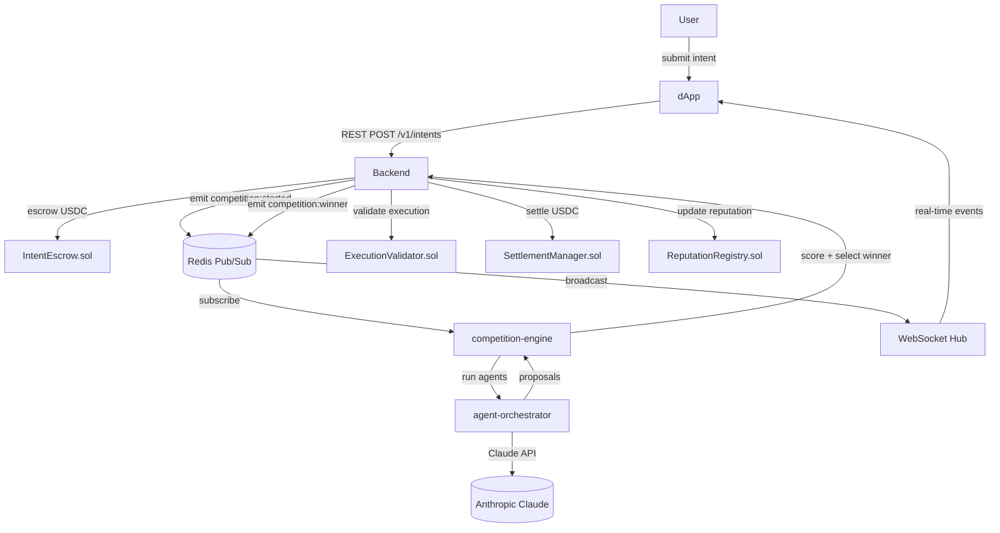

# Intent — Architecture Reference

## System Overview

Intent is a stablecoin-native autonomous execution marketplace. Users submit outcome-based intents; AI-powered agents compete to fulfill them; the best agent wins execution rights and builds on-chain reputation.



---

## Architectural Decisions

### 1. Monorepo: pnpm workspaces + Turborepo
**Why:** Shared types, config, and UI components across apps with zero duplication. Turborepo caching means incremental builds — changing `packages/ui` only rebuilds dependent apps.

### 2. Go Backend: Modular Monolith
**Why over microservices:** Hackathon velocity. Single binary, no service mesh complexity. Clean internal package boundaries (`internal/domain/*`, `internal/services/*`) make extraction trivial later. Event-driven via Redis pub/sub decouples services without distributed transaction complexity.

### 3. SQLC over GORM/Prisma
**Why:** Type-safe SQL queries without ORM magic. Generated Go types match DB schema exactly. No N+1 risk. Better performance for PostgreSQL-heavy workloads.

### 4. Redis Pub/Sub as Event Bus
**Why:** Decouples backend services from agent services without Kafka complexity. Each service subscribes to relevant channels. WebSocket hub subscribes to all channels and fans out to connected clients.

**Channels:**
```
intent:created
competition:started:{intentId}
competition:proposal:{competitionId}
competition:winner:{competitionId}
execution:status:{executionId}
leaderboard:updated
agent:reputation:{agentId}
```

### 5. Claude as Agent Intelligence
**Why:** Claude's tool-use capability lets agents call real-world functions (price feeds, slippage estimation, chain state) within a reasoning loop. Each agent strategy is a system prompt + user prompt + tools. The scoring orchestrator also uses Claude to rank proposals objectively.

**Agent model:** `claude-sonnet-4-6` (production quality, fast enough for 30s competition windows)

**Agents:**
| Agent | Strategy | Claude Role |
|-------|----------|-------------|
| TWAP Agent | Time-weighted execution | Adapts interval timing to market conditions |
| Momentum Agent | Trend-following | Reads price momentum, times entry |
| Shadow Agent | Simulation-based | Runs parallel execution simulations, picks best path |
| Arbitrage Agent | Cross-venue | Detects price discrepancies across DEXs |

### 6. UUPS Upgradeable Contracts
**Why:** Hackathon contracts will have bugs. UUPS (Universal Upgradeable Proxy Standard) lets us upgrade logic without redeploying proxy or migrating state. Upgrader role gated to multisig post-launch.

### 7. wagmi v2 + viem
**Why over ethers.js:** Better TypeScript types, tree-shakeable, React hooks built-in, no class instances. RainbowKit provides wallet connection UI with Arc chain support via custom chain definition.

---

## Reputation System

### Scoring Algorithm (ELO-inspired)

```
Initial score: 1000 points

Win:
  delta = base_win_points * quality_factor
  quality_factor = (actual_amountOut - projected_amountOut) / projected_amountOut + 1
  Win delta range: +5 to +50 points

Loss:
  delta = -base_loss_points * margin_factor
  margin_factor = (winner_score - agent_score) / winner_score
  Loss delta range: -2 to -20 points

Decay:
  Applied daily to inactive agents
  decay = score * 0.005 (0.5% per day)

Slash:
  Applied on-chain by SLASHER_ROLE for provable misconduct
  Fixed amount determined by governance
```

### Competition Scoring Weights
```
Total Score = 40% × qualityScore + 35% × reputationScore + 25% × slippageScore

qualityScore:     projected execution quality vs intent requirements
reputationScore:  agent's historical on-chain reputation (normalized 0-100)
slippageScore:    projected slippage vs market baseline (lower = better)
```

---

## Database Schema

See [backend/db/migrations/001_init.sql](../backend/db/migrations/001_init.sql) for full schema.

### Key Tables
| Table | Purpose |
|-------|---------|
| `users` | Wallet addresses |
| `intents` | User-submitted outcomes |
| `agents` | Registered execution agents |
| `competitions` | Per-intent competition instances |
| `competition_proposals` | Agent proposals per competition |
| `executions` | Actual trade executions |
| `reputation_history` | Score change audit log |
| `settlements` | USDC settlement records |
| `leaderboard_snapshots` | Periodic leaderboard captures |

### Indexing Strategy
- `intents(user_id, status)` — user's intent list
- `intents(status, created_at DESC)` — pending intent queue
- `competitions(intent_id)` — competition lookup
- `competition_proposals(competition_id)` — proposals per competition
- `executions(agent_id, status)` — agent execution history
- `reputation_history(agent_id, recorded_at DESC)` — score history
- `leaderboard_snapshots(snapshot_at DESC, rank)` — current leaderboard

### Caching Strategy (Redis)
| Key | Value | TTL |
|-----|-------|-----|
| `leaderboard:current` | Sorted set by score | 30s |
| `agent:{id}:score` | Current score | 60s |
| `competition:{id}:proposals` | Active proposals hash | Competition window |
| `intent:{id}:status` | Status string | 300s |
| `session:{userId}` | JWT session | 24h |

---

## WebSocket Architecture

```
Client (dApp)
     │  WS /ws
     ▼
  Hub (Go)         ← single goroutine manages client registry
     │
     ├── Broadcaster ← goroutine subscribes to all Redis channels
     │       │
     │       └── Redis Pub/Sub ← all services publish here
     │
     └── Client (per connection) ← goroutine per client, typed message dispatch
```

### Client Connection Flow
1. Client connects to `ws://api/ws` with JWT token
2. Hub registers client, starts read/write goroutines
3. Client sends subscription messages for specific entities
4. Broadcaster receives Redis events and routes to subscribed clients
5. On disconnect, Hub removes client and closes goroutines

---

## Smart Contract Architecture

### Access Roles
| Role | Permissions |
|------|-------------|
| `OPERATOR_ROLE` | Manage competitions, trigger releases |
| `VALIDATOR_ROLE` | Update reputation scores |
| `SLASHER_ROLE` | Slash agent reputation |
| `SETTLER_ROLE` | Complete settlements |
| `UPGRADER_ROLE` | Upgrade contract logic (multisig) |

### Escrow Flow
```
User → approve(USDC, escrow) → deposit(intentId, amount)
     [competition runs]
winner selected →
  OPERATOR → release(intentId, agent, amount)
  SettlementManager → deduct fee → transfer net to agent
  ReputationRegistry → updateScore(agent, +delta)
```

---

## AI Agent Design

### Tool-Use Pattern
Each agent has access to:
- `get_price(tokenIn, tokenOut)` — current market price
- `estimate_slippage(tokenIn, tokenOut, amountIn)` — price impact
- `get_agent_history(agentId)` — own historical performance
- `read_chain_state(contract, method, args)` — on-chain data

### Competition Flow
```
intent arrives →
  AgentRunner.collectProposals(intent, competitionId) [parallel]
    ├── TWAPAgent.propose()     → Claude call → AgentProposal
    ├── MomentumAgent.propose() → Claude call → AgentProposal
    ├── ShadowAgent.propose()   → Claude call → AgentProposal
    └── ArbAgent.propose()      → Claude call → AgentProposal
  ScoringOrchestrator.rankProposals(proposals, intent)
    └── Claude scores all proposals → ranked ScoredProposal[]
  winner = proposals[0]
  publish competition:winner event
```

---

## API Reference

Base URL: `http://localhost:8080`

### Endpoints
| Method | Path | Description |
|--------|------|-------------|
| GET | `/health` | Health check |
| POST | `/v1/intents` | Submit intent |
| GET | `/v1/intents` | List user intents |
| GET | `/v1/intents/:id` | Get intent detail |
| GET | `/v1/competitions` | List competitions |
| GET | `/v1/competitions/:id` | Get competition detail |
| GET | `/v1/agents` | List registered agents |
| GET | `/v1/agents/:id` | Get agent profile |
| GET | `/v1/leaderboard` | Current leaderboard |
| GET | `/ws` | WebSocket connection |

Full OpenAPI spec generated at `backend/docs/swagger/` (run `make generate`).

---

## Deployment

### Local Development
```bash
make setup   # one-time setup
make dev     # start everything
```

### Arc Testnet
```bash
# 1. Deploy contracts
cd contracts
forge script script/Deploy.s.sol --rpc-url $ARC_RPC_URL --broadcast

# 2. Update deployments/arc-testnet.json with deployed addresses

# 3. Update packages/config/src/addresses.ts with deployed addresses

# 4. Deploy backend
docker build -t intent-api ./backend
# Push to your container registry

# 5. Deploy frontend apps to Vercel
# vercel --cwd apps/website
# vercel --cwd apps/dapp
```

---

## Environment Variables

See [.env.example](../.env.example) for the full list. Critical variables:

| Variable | Required | Description |
|----------|----------|-------------|
| `ANTHROPIC_API_KEY` | Yes | Claude API key for AI agents |
| `DATABASE_URL` | Yes | PostgreSQL connection string |
| `REDIS_URL` | Yes | Redis connection string |
| `JWT_SECRET` | Yes | Min 32 chars |
| `ARC_RPC_URL` | For on-chain | Arc L1 RPC endpoint |
| `NEXT_PUBLIC_WALLETCONNECT_PROJECT_ID` | For dApp | WalletConnect v2 project ID |